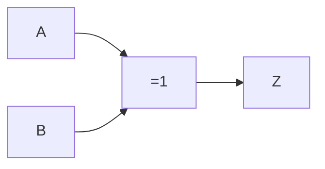

# Intersección
Únicamente los elementos comunes entre dos o más conjuntos. Se representa con la multiplicación ($A \cdot B$).

Para dos conjuntos $A$ y $B$:
$$
A \cap B = C
$$

Es equivalente a la compuerta *AND*, y es representada como:
