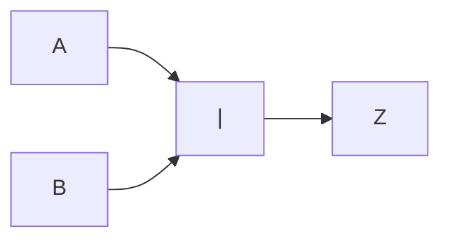
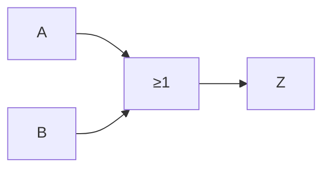

# Unión (OR)

Todos los elementos presentes en dos o más conjuntos, comunes o no. Se representa con la suma ($A+B$).

Para dos conjuntos $A$ y $B$:

$$
A \cup B= C
$$

Es equivalente a la compuerta *OR*, y es representada como:

O también como:

## Tabla de verdades

| $A$ | $B$ | $Z=AB=A \lor B$ |
| --- | --- | ---------------- |
| 0   | 0   | 0                |
| 0   | 1   | 1                |
| 1   | 0   | 1                |
| 1   | 1   | 1                |
