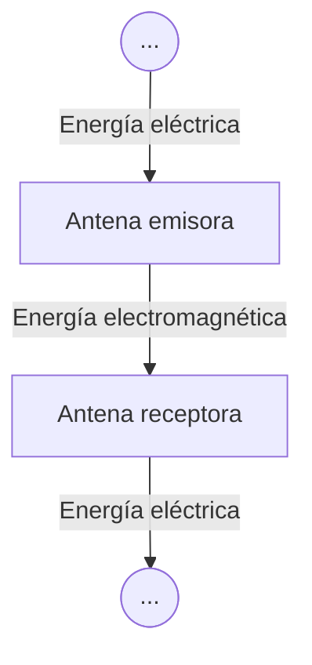

---
aliases:
  - Antenas
created: 2025-05-15 14:43:51
modified: 2025-05-15 14:55:07
title: Antena
---

# Antena

Un ==conductor== eléctrico, o [[Conjunto]] de conductores, utilizado para ==radiar o captar== [[Energía]] electromagnética.

> [!important]
> Las [[Antena|Antenas]] suelen ser tanto [[Emisor|Emisores]] como [[Receptor|Receptores]].

En general, una antena radiará potencia en todas las direcciones, si bien normalmente no lo hará igual de bien en todas las direcciones. Una forma habitual de caracterizar las prestaciones de una antena es mediante su diagrama de radiación, el cual consiste en una representación gráfica de las propiedades de radiación de la antena en función de la dirección. El diagrama de radiación más simple corresponde con el caso ideal, denominado la antena isotrópica. Una antena isotrópica es un punto en el espacio que radia potencia de igual forma en todas las direcciones. En este caso, el diagrama de radiación consistirá en una esfera centrada en la posición de la antena isotrópica.
