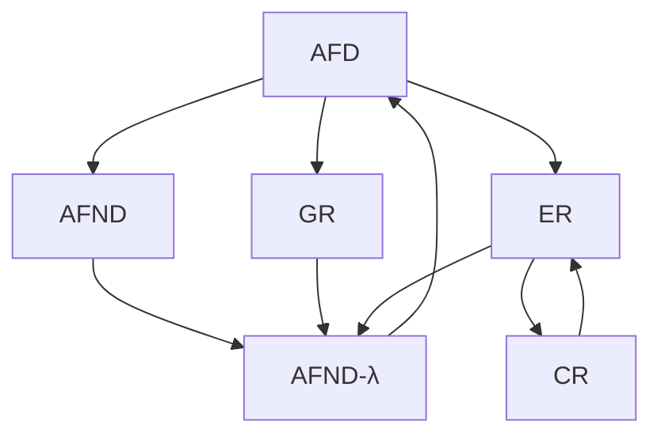

# Clasificación de Chomsky

Siempre buscamos utilizar la ==clasificación que mejor se ajuste== a la [[Gramática]], pues algunas están contenidas dentro de otras.

$$
T3 \subset T2 \subset T1 \subset T0
$$

## Tipo 3: Regular

Una [[Gramática]] $G$ se llama ==regular== o tipo 3 si sus [[Gramática#Producciones|Producciones]] son de la siguiente forma.

$$
\left( A \to aB, A \to a \right)
\lor
\left( A \to Ba, A \to a \right)
/
A, B \in N \land a \in T
$$

Una [[Gramática]] ==regular== es solo una forma de representar [[Lógica y Estructuras Discretas/Lenguaje|Lenguajes]] regulares.

## Tipo 2: Libre de contexto

Una [[Gramática]] $G$ se llama libre de contexto, independiente de contexto, o tipo 2 si sus [[Gramática#Producciones|Producciones]] son de la siguiente forma.

$$
\left( A \to \alpha \right)
/
A \in N \land \alpha \in \left( T \cup N \right)^* - \set{\lambda}
$$

Es decir, si todas las [[Gramática#Producciones|Producciones]] se derivan en cualquier combinación de terminales y no terminales, excepto la [[Cadena vacía]] $\lambda$.

## Tipo 1: Sensible al contexto

Una [[Gramática]] $G$ se llama sensible al contexto o tipo 1 si sus [[Gramática#Producciones|Producciones]] son de la siguiente forma.

$$
\left( \alpha A \beta \to \alpha \gamma \beta \right)
/
A \in N \land \alpha, \beta, \gamma \in \left( T \cup N \right)^* - \set{\lambda}
$$

La parte derecha de una producción debe ser, en longitud, mayor o igual que la longitud de la parte izquierda.

## Tipo 0: Recursivamente enumerada

Una [[Gramática]] $G$ se llama tipo 0 en caso contrario.

> [!tip]
> Todas las [[Gramática|Gramáticas]] son de tipo 0, pero siempre debemos utilizar la clasificación más reducida aplicable.
