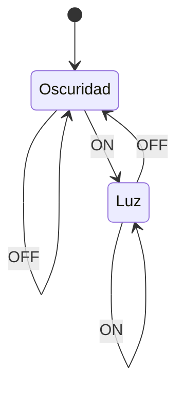

# Diagrama de estados

Un diagrama que permite representar el flujo de [[Entradas]], [[Salidas]] y [[Lógica y Estructuras Discretas/Estado|Estados]] de una [[Máquina]].

Por ejemplo, el [[Diagrama de estados]] de una lámpara.

