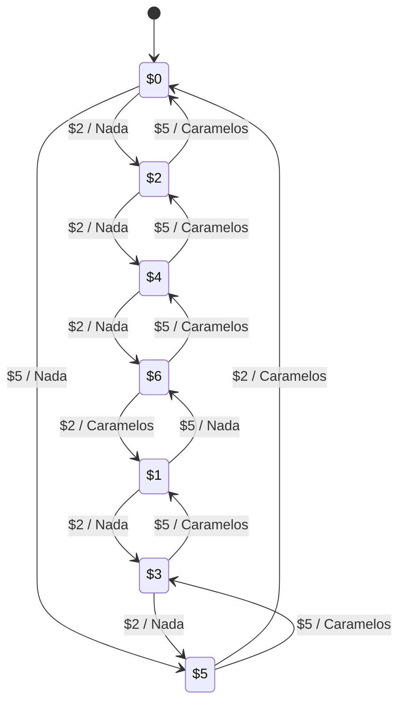

---
aliases:
  - Máquinas de Mealy
created: 2025-03-01 21:39:22
modified: 2025-03-01 21:45:52
title: Máquina de Mealy
---

# Máquina de Mealy

Una [[Máquina de estados finitos]] donde el [[Lógica y Estructuras Discretas/Estado|Estado]] no determina directamente la [[Salidas|Salida]].

Por ejemplo, una máquina expendedora de caramelos de $7, que solo acepta monedas de $2 y $5.

