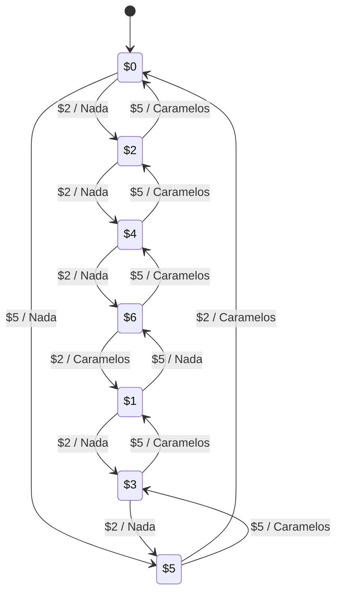

---
aliases:
  - Máquinas de Mealy
created: 2025-03-01 21:39:22
modified: 2025-03-01 22:48:13
title: Máquina de Mealy
---

# Máquina de Mealy

Una [[Máquina de estados finitos]] donde el [[Lógica y Estructuras Discretas/Estado|Estado]] no determina directamente la [[Salidas|Salida]].

Por ejemplo, una máquina expendedora de caramelos de $7, que solo acepta monedas de $2 y $5.

$$
\begin{array}{c}
    I = \set{\text{\$2}, \text{\$5}} \\
    O = \set{\text{Nada}, \text{Caramelos}} \\
    k = \set{\$0, \$1, \$2, \$3, \$4, \$5, \$6} \\
    q_0 = \$0 \\
\end{array}
$$

| $f$ | $2  | $5  |
| --- | --- | --- |
| $0  | $2  | $5  |
| $1  | $3  | $6  |
| $2  | $4  | $0  |
| $3  | $5  | $1  |
| $4  | $6  | $2  |
| $5  | $0  | $3  |
| $6  | $1  | $4  |

| $g$ | $2        | $5        |
| --- | --------- | --------- |
| $0  | Nada      | Nada      |
| $1  | Nada      | Nada      |
| $2  | Nada      | Caramelos |
| $3  | Nada      | Caramelos |
| $4  | Nada      | Caramelos |
| $5  | Caramelos | Caramelos |
| $6  | Caramelos | Caramelos |

Con estos datos podemos formar la [[Máquina de Mealy]].

$$
M = \left( I, O, k, q_0, f, g \right)
$$
