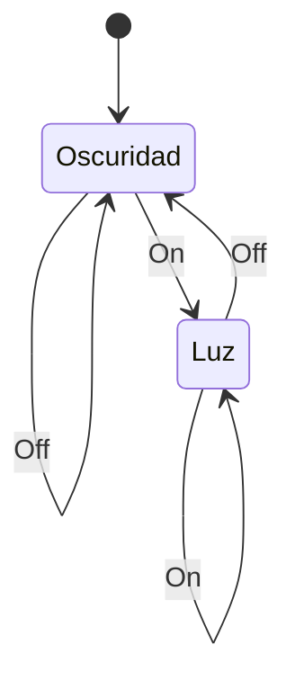

---
aliases:
  - Máquinas de Moore
created: 2025-03-01 21:38:19
modified: 2025-03-01 22:40:52
title: Máquina de Moore
---

# Máquina de Moore

Una [[Máquina de estados finitos]] donde cada [[Lógica y Estructuras Discretas/Estado|Estado]] está asociado a una única [[Salidas|Salida]].

Por ejemplo, una lámpara, donde $q_1$ es oscuridad y $q_2$ es luz.

| $f$   | On    | Off   |
| ----- | ----- | ----- |
| $q_1$ | $q_2$ | $q_1$ |
| $q_2$ | $q_2$ | $q_1$ |

| $g$   | $O$       |
| ----- | --------- |
| $q_1$ | Oscuridad |
| $q_2$ | Luz       |
$$
\begin{array}{c}
    I = \set{\text{On}, \text{Off}} \\
    O = \set{\text{Oscuridad}, \text{Luz}} \\
    k = \set{q_1, q_2} \\
    q_0 = q_1 \\
    M = \left(  \right)
\end{array}
$$