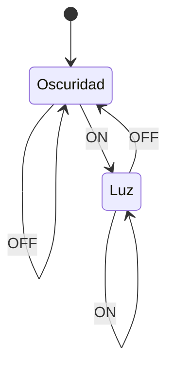

---
aliases:
  - Máquinas de Moore
created: 2025-03-01 21:38:19
modified: 2025-03-01 21:40:08
title: Máquina de Moore
---

# Máquina de Moore

Una [[Máquina de estados finitos]] donde cada [[Lógica y Estructuras Discretas/Estado|Estado]] está asociado a una única [[Salidas|Salida]].

Por ejemplo, una lámpara.

