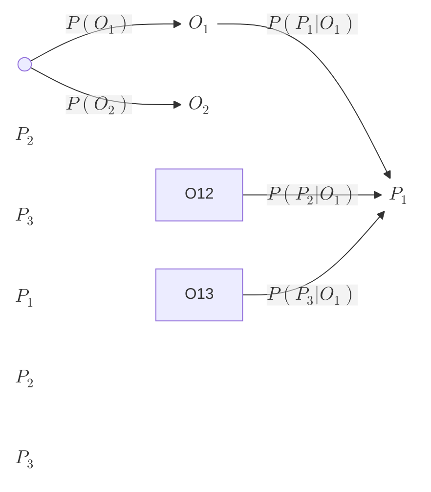

---
aliases:
  - Diagramas de árbol
created: 2025-06-22 16:41:22
modified: 2025-06-22 16:47:12
title: Diagrama de árbol
---

# Diagrama de árbol

Un diagrama de [[Árbol]] es una forma de representar visualmente todas las posibilidades en problemas de conteo y [[Probabilidad]].

