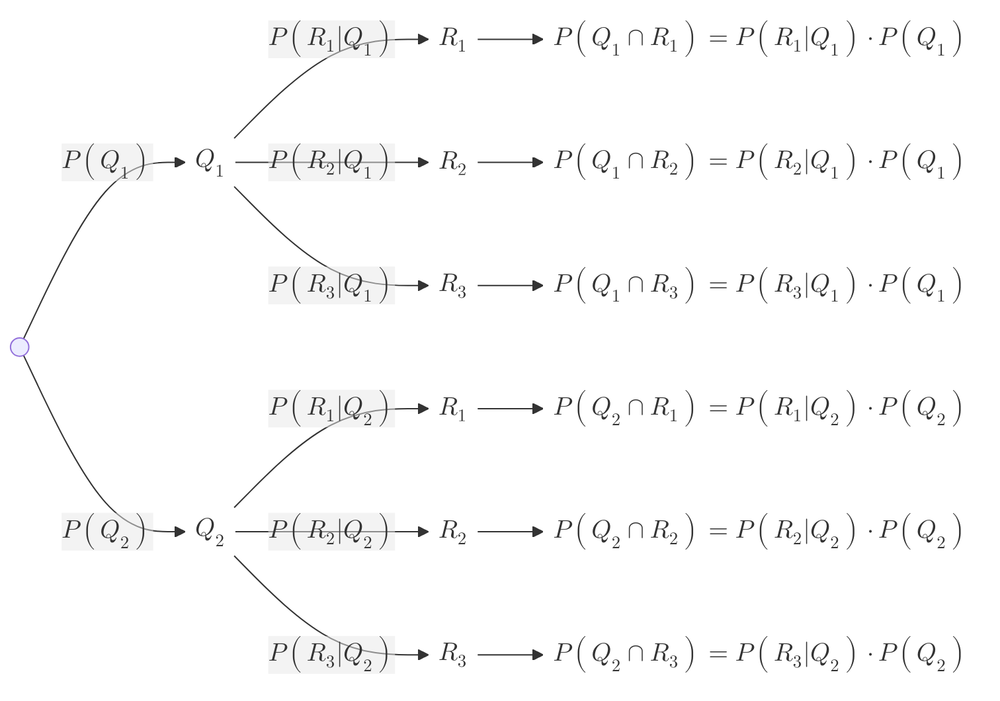

---
aliases:
  - Diagramas de árbol
created: 2025-06-22 16:41:22
modified: 2025-06-22 17:41:27
title: Diagrama de árbol
---

# Diagrama de árbol

Un diagrama de [[Árbol]] es una forma de representar visualmente todas las posibilidades en un [[Experimento]] con [[Eventos mutuamente excluyentes]].

Luego, si quiero calcular la [[Probabilidad]] de cualquiera de los [[Evento|Eventos]] en las hojas del [[Diagrama de árbol]], solo debo seguir el camino desde el inicio hasta el [[Evento]], multiplicando la [[Probabilidad]] de cada [[Evento]] que pase.

$$
P \left( Q_i \cap R_j \right) = P \left( R_j \vert Q_i \right) \cdot P \left( Q_i \right)
$$
