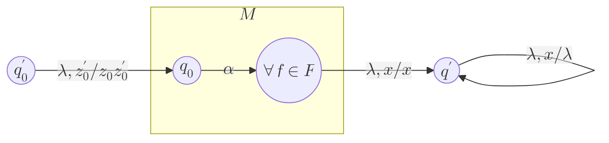
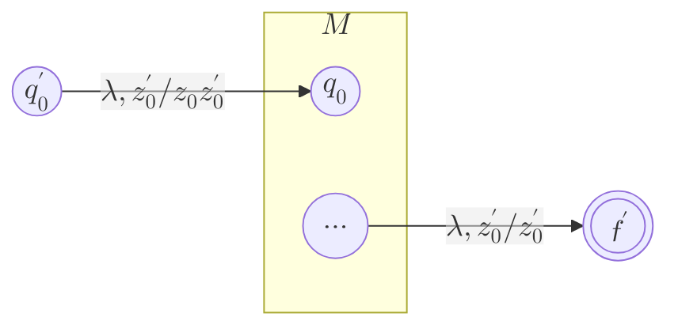

---
aliases:
  - Autómatas de pila
  - AP
created: 2025-06-14 23:12:10
modified: 2025-06-15 01:11:07
title: Autómata de pila
---

# Autómata de pila

Un [[Autómata]] $M$ que utiliza una [[Pila]] para representar un [[Lenguaje libre de contexto]].

$$
M = \left< K, \Sigma, \Gamma, \delta, q_0, z_0, F \right>
$$

- $K$: [[Conjunto]] de [[Lógica y Estructuras Discretas/Estado|Estados]]
- $\Sigma$: [[Alfabeto]] finito de [[Entradas|Entrada]]
- $\Gamma$: [[Alfabeto]] finito de la pila
- $\delta$: [[Función de transición]] definida por $\delta: K \times \left( \Sigma \cup \set{ \lambda } \right) \times \Gamma \to P \left( K \times \Gamma^* \right)$
- $q_0$: [[Lógica y Estructuras Discretas/Estado|Estado]] inicial del [[Autómata]], $q_0 \in K$
- $z_0$: Configuración inicial de la [[Pila]], $z_0 \in \Gamma$
- $F$: [[Conjunto]] de [[Lógica y Estructuras Discretas/Estado|Estados]] aceptados o finales, $F \subseteq K$

> [!tip]
> En cada transición solo es posible consultar el tope de la [[Pila]], y en cada transición, dicho elemento **siempre** se consume. Sin embargo, al realizar la transición, pueden agregarse a la [[Pila]] tantos elementos como se desee, o ninguno.

---

La [[Configuración instantánea]] del [[Autómata de pila|AP]] está definida en:

$$
K \times \Sigma^* \times \Gamma^*
$$

Representada por $\left( q, \alpha, \tau \right)$ , donde $q$ es el [[Lógica y Estructuras Discretas/Estado|Estado]] actual, $\alpha$ es la [[Lógica y Estructuras Discretas/Cadena|Cadena]] que aún falta consumir, y $\tau$ es el contenido de la [[Pila]].

---

Un [[Lexema]] puede ser aceptado por un [[Autómata de pila|AP]] de dos formas diferentes: cuando al consumir toda la [[Lógica y Estructuras Discretas/Cadena|Cadena]] el mismo llega a un [[Lógica y Estructuras Discretas/Estado|Estado]] final, generando un [[Lógica y Estructuras Discretas/Lenguaje|Lenguaje]] aceptado $L \left( M \right)$:

$$
L \left( M \right) = \set{ \alpha \in \Sigma^*: \left( q_0, \alpha, z_0 \right) \vdash^* \left( r, \lambda, p \right) \land r \in F }, p \in \Gamma^*
$$

O cuando la [[Pila]] se vacía completamente, y al mismo tiempo se termina de consumir la [[Lógica y Estructuras Discretas/Cadena|Cadena]]:

$$
L \left( M \right) = \set{ \alpha \in \Sigma^*: \left( q_0, \alpha, z_0 \right) \vdash^* \left( r, \lambda, \lambda \right) }
$$

> [!warning]
> Cuando la [[Pila]] está vacía, el [[Autómata de pila|AP]] no puede realizar ninguna transición más.

## Pasaje de AP de aceptación por estado final a AP de aceptación por pila vacía

Sea $M = \left< K, \Sigma, \Gamma, \delta, q_0, z_0, F \right>$ un [[Autómata de pila|AP]] que acepta por [[Lógica y Estructuras Discretas/Estado|Estado]] final, definimos $M' = \left< K', \Sigma, \Gamma', \delta', q_0', z_0', F' \right>$ un [[Autómata de pila|AP]] que acepta por [[Pila]] vacía.

Definimos el [[Conjunto]] de [[Lógica y Estructuras Discretas/Estado|Estados]] $K' = K \cup \set{ q_0' } \cup \set{ q' }$, $q_0', q' \notin K$; el [[Alfabeto]] de la [[Pila]] $\Gamma' = \Gamma \cup \set{ z_0' }$; y el [[Conjunto]] de [[Lógica y Estructuras Discretas/Estado|Estados]] finales $F' = \emptyset$. Finalmente, definimos la [[Función de transición]] $\delta'$:

$$
\delta' \left( q, a, t \right) =
\left\{
    \begin{array}{l}
        \delta \left( q, a, t \right) \space &\text{si} \space q \in K \\
        \set{ \left( q_0, z_0 z_0' \right) } \space &\text{si} \space q = q_0' \land a = \lambda \land t = z_0' \\
        \set{ \left( q', t \right) } \space &\text{si} \space q \in F \land a = \lambda \\
        \set{ \left( q', \lambda \right) } \space &\text{si} \space q = q' \land a = \lambda \\
    \end{array}
\right.
$$

> [!note]
> El [[Conjunto]] de [[Lógica y Estructuras Discretas/Estado|Estados]] finales es $\emptyset$ ya que el [[Autómata de pila|AP]] acepta por [[Pila]] vacía.

## Pasaje de AP de aceptación por pila vacía a AP de aceptación por estado final

Sea $M = \left< K, \Sigma, \Gamma, \delta, q_0, z_0, F \right>$ un [[Autómata de pila|AP]] que acepta por [[Pila]] vacía, definimos $M' = \left< K', \Sigma, \Gamma', \delta', q_0', z_0', F' \right>$ un [[Autómata de pila|AP]] que acepta por [[Lógica y Estructuras Discretas/Estado|Estado]] final.

Definimos el [[Conjunto]] de [[Lógica y Estructuras Discretas/Estado|Estados]] $K' = K \cup \set{ q_0' } \cup \set{ f' }$; el [[Alfabeto]] de la [[Pila]] $\Gamma' = \Gamma \cup \set{ z_0' }$; y el [[Conjunto]] de [[Lógica y Estructuras Discretas/Estado|Estados]] finales $F' = \set{ f' }$. Finalmente, definimos la [[Función de transición]] $\delta'$:

$$
\delta' \left( q, a, t \right) =
\left\{
    \begin{array}{l}
        \delta \left( q, a, t \right) \space &\text{si} \space q \in K \land t \neq z_0' \\
        \set{ \left( q_0, z_0 z_0' \right) } \space &\text{si} \space q = q_0' \land a = \lambda \land t = z_0' \\
        \set{ \left( f', z_0' \right) } \space &\text{si} \space q \in K \land a = \lambda \land t = z_0' \\
    \end{array}
\right.
$$

> [!note]
> Una vez que en la [[Pila]] solo queda $z_0'$, se realiza una transición, desde cualquier [[Lógica y Estructuras Discretas/Estado|Estado]] de $M$, consumiendo $\lambda$, terminando en el [[Lógica y Estructuras Discretas/Estado|Estado]] final $f'$, con la siguiente [[Configuración instantánea]]:
>
> $$
> \left( f', \lambda, z_0' \right)
> $$
