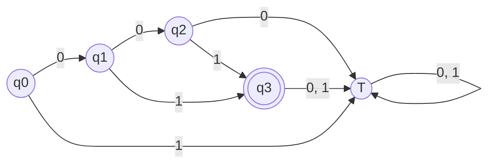

---
aliases:
  - Diagramas de transición
  - Diagrama de estados
  - Diagramas de estados
created: 2025-06-07 20:17:37
modified: 2025-06-10 17:58:45
title: Diagrama de transición
---

# Diagrama de transición

Es una representación gráfica de un [[Autómata finito]].

- Cada círculo es un estado
- Cada círculo doble es un estado final
- Una flecha apuntando a un estado indica que es el estado inicial
- Cada arco dirigido representa una parte de la [[Función de transición]]
- El símbolo sobre el arco indica qué produjo esa transición

La definición formal de este [[Autómata finito|AF]] $M$ es la siguiente.

$$
M = \left< \set{ q_0, q_1, q_2, q_3 }, \set{ 0, 1 }, q_0, \delta, \set{ q_3 } \right>
$$

$$
\begin{array}{c}
    \delta \left( q_0, 0 \right) = \set{ q_1 } \\
    \delta \left( q_1, 0 \right) = \set{ q_2 } \\
    \delta \left( q_2, 1 \right) = \set{ q_3 } \\
    \delta \left( q_1, 1 \right) = \set{ q_3 } \\
    \delta \left( q_0, 1 \right) = \delta \left( q_2, 0 \right) = \delta \left( q_3, 0 \right) = \delta \left( q_3, 1 \right) = \set{ T } \\
\end{array}
$$

> [!note]
> El [[Autómata finito|AF]] $M$ acepta el [[Lógica y Estructuras Discretas/Lenguaje|Lenguaje]] $L = \set{ 01, 001 }$.
