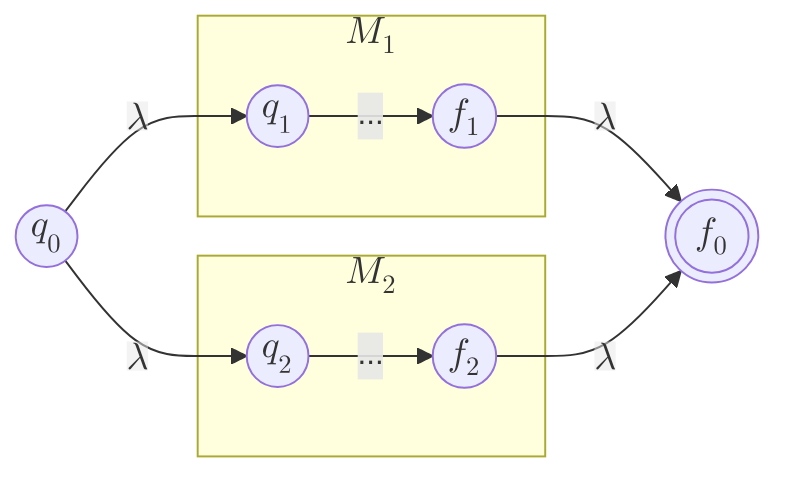
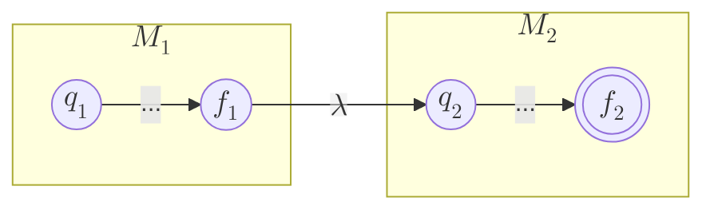
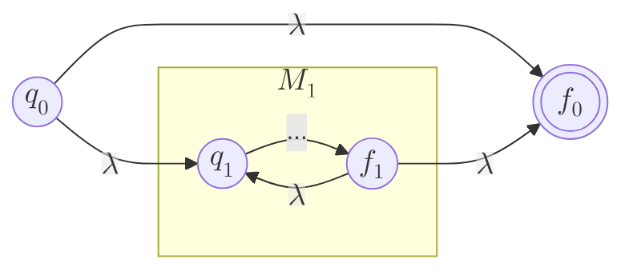

---
aliases:
  - Expresiones regulares
  - ER
  - REGEX
created: 2025-06-10 21:47:38
modified: 2025-06-14 19:24:40
title: Expresión regular
---

# Expresión regular

Es un formalismo para expresar un [[Lógica y Estructuras Discretas/Lenguaje|Lenguaje]] ==regular== (tipo 3).

Sea un [[Alfabeto]] $\Sigma$, las [[Expresión regular|ER]] sobre $\Sigma$ y los [[Conjunto|Conjuntos]] que ellas denotan ([[Conjunto regular|Conjuntos regulares]]) son definidos recursivamente de la siguiente forma.

1. $\emptyset$ es una [[Expresión regular|ER]] y denota el [[Conjunto vacío]] $\emptyset$
2. $\lambda$ es una [[Expresión regular|ER]] y denota el [[Conjunto]] $\set{ \lambda }$
3. Por cada $a \in \Sigma$, $a$ es una [[Expresión regular|ER]] y denota el [[Conjunto]] $\set{ a }$
4. Si $r$ y $s$ son [[Expresión regular|ER]] que denotan los [[Lógica y Estructuras Discretas/Lenguaje|Lenguajes]] $R$ y $S$, entonces:
	- $r + s \Leftrightarrow r / s$ es una [[Expresión regular|ER]] y denota $R \cup S$
	- $rs \Leftrightarrow r \cdot s$ es una [[Expresión regular|ER]] y denota $R \circ S$ (concatenación)
	- $r^*$ es una [[Expresión regular|ER]] y denota el [[Conjunto]] $R^*$ ([[Cerradura de Kleene]] de $R$)

> [!tip]
> Por la definición de la [[Cerradura de Kleene]] y la [[Cerradura positiva]], las siguientes expresiones son equivalentes.
>
> $$
> rr^* = r^+
> $$

## Pasaje de ER a AFD

La [[Expresión regular|ER]] inicial $u$ representa el [[Lógica y Estructuras Discretas/Lenguaje|Lenguaje]] $L_0 = L \left( u \right)$ que será aceptado por el [[Lógica y Estructuras Discretas/Estado|Estado]] inicial $q_0$ del [[Autómata finito determinístico|AFD]]. Luego, se calculan las [[Derivada de una expresión regular|Derivadas]] de la [[Expresión regular|ER]] para cada símbolo del alfabeto $\Sigma$; cada [[Expresión regular|ER]] $L_i$ diferente resultante representa un [[Lógica y Estructuras Discretas/Estado|Estado]] $q_i$ del [[Autómata finito determinístico|AFD]], que se alcanza ante una transición por el símbolo $a \in \Sigma$ respecto al cual se realizó la [[Derivada de una expresión regular|Derivada]] $D_a \left( L_0 \right) = L_i$.

> [!important]
> Un [[Lógica y Estructuras Discretas/Estado|Estado]] es final si el [[Lógica y Estructuras Discretas/Lenguaje|Lenguaje]] que representa contiene la [[Cadena vacía]] $\lambda$; es decir, si $T \left( L_i \right)$ no es $\emptyset$.

## Pasaje de ER a AFND-λ

Sea $r$ una [[Expresión regular|ER]], entonces existe un [[Autómata finito no determinístico lambda|AFND-λ]] $M$ que acepta $L \left( r \right)$.

### Disyunción

Dadas dos [[Expresión regular|ER]] $r_1$ y $r_2$, con sus [[Autómata finito|Autómatas finitos]] asociados $M_1$ y $M_2$, su [[Disyunción (∨)]] $r = r_1 + r_2 = r_1 / r_2$ puede ser representada de la siguiente forma.

$$
r = r_1 + r_2 \land L \left( r_1 \right) = L \left( M_1 \right) \land L \left( r_2 \right) = L \left( M_2 \right) \Rightarrow L \left( r \right) = L \left( M \right)
$$

> [!note]
> $f_1$ y $f_2$ son los [[Lógica y Estructuras Discretas/Estado|Estados]] finales de $M_1$ y $M_2$ respectivamente, pero el único [[Lógica y Estructuras Discretas/Estado|Estado]] final de $M$ es $f_0$, y su [[Lógica y Estructuras Discretas/Estado|Estado]] inicial es $q_0$.

### Concatenación

Dadas dos [[Expresión regular|ER]] $r_1$ y $r_2$, con sus [[Autómata finito|Autómatas finitos]] asociados $M_1$ y $M_2$, su concatenación $r = r_1 r_2 = r_1 \cdot r_2$ puede ser representada de la siguiente forma.

$$
r = r_1 r_2 \land L \left( r_1 \right) = L \left( M_1 \right) \land L \left( r_2 \right) = L \left( M_2 \right) \Rightarrow L \left( r \right) = L \left( M \right)
$$

> [!note]
> $f_1$ y $f_2$ son los [[Lógica y Estructuras Discretas/Estado|Estados]] finales de $M_1$ y $M_2$ respectivamente, pero el único [[Lógica y Estructuras Discretas/Estado|Estado]] final de $M$ es $f_2$, y su [[Lógica y Estructuras Discretas/Estado|Estado]] inicial es $q_1$.

### Cerradura de Kleene

Dada una [[Expresión regular|ER]] $r_1$, con su [[Autómata finito|Autómata finito]] asociado $M_1$, su [[Cerradura de Kleene]] $r = r_1^*$ puede ser representada de la siguiente forma.

$$
r = r_1^* \land L \left( r_1 \right) = L \left( M_1 \right) \Rightarrow L \left( r \right) = L \left( M \right)
$$

> [!note]
> $f_1$ es el [[Lógica y Estructuras Discretas/Estado|Estado]] final de $M_1$, pero el único [[Lógica y Estructuras Discretas/Estado|Estado]] final de $M$ es $f_0$, y su [[Lógica y Estructuras Discretas/Estado|Estado]] inicial es $q_0$.
