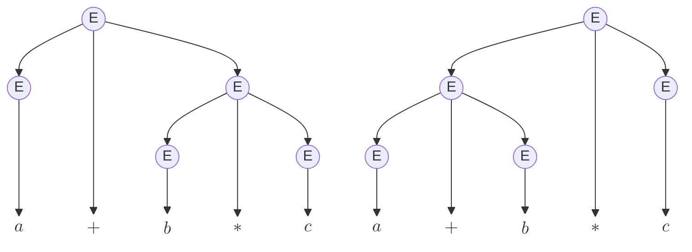

---
aliases:
  - Gramáticas ambiguas
created: 2025-06-15 20:08:56
modified: 2025-06-15 20:28:43
title: Gramática ambigua
---

# Gramática ambigua

Una [[Gramática libre de contexto]] $G = \left< N, T, P, S \right>$ se considera ambigua si existe una [[Lógica y Estructuras Discretas/Cadena|Cadena]] $\alpha \in L \left( G \right)$, base de dos [[Árbol de derivación|Árboles de derivación]] $\tau \left( S \right)$ y $\tau' \left( S \right)$, tales que:

$$
\tau \left( S \right) \neq \tau' \left( S \right)
$$

> [!tip]
> Es decir, si existe una [[Lógica y Estructuras Discretas/Cadena|Cadena]] del [[Lógica y Estructuras Discretas/Lenguaje|Lenguaje]] generado por $G$, para la cual existen múltiples [[Árbol de derivación|Árboles de derivación]] válidos diferentes.

---

Por ejemplo, sea la siguiente [[Gramática libre de contexto|GLC]]:

$$
G = \left< \set{ E }, \set{ \text{id}, +, * }, \set{ E \to E + E | E * E | \text{id} }, S \right>
$$

Para la [[Lógica y Estructuras Discretas/Cadena|Cadena]] $\alpha = a + b * c$ existen dos [[Árbol de derivación|Árboles de derivación]]:

