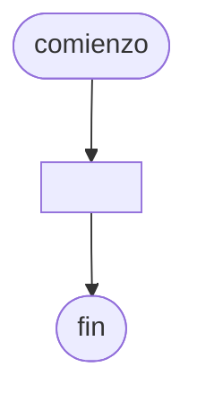

# {{date}} - Actividad

...

## Pseudocódigo

```
comienzo

declarar a = entero, b = real

fin
```

## Diagrama de flujo



## Código

```embed-python
PATH: "vault://Algoritmos y Estructuras de Datos/python/{{date}}-producciones.py"
```
