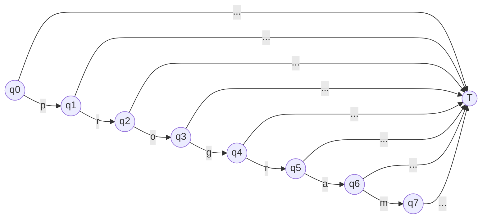

# Untitled

```mermaid
flowchart LR
    q0(("q0"))
    q1(("q1"))
    q2(("q2"))
    q3(("q3"))
    q4(("q4"))
    q5(("q5"))
    q6(("q6"))
    q7(("q7"))
    T(("T"))

    q0 -- "p " --> q1 -- "r" --> q2 -- "o" --> q3 -- "g" --> q4 -- "r" --> q5 -- "a" --> q6 -- "m" --> q7
    q0 & q1 & q2 & q3 & q4 & q5 & q6 & q7 -- "..." --> T
```
